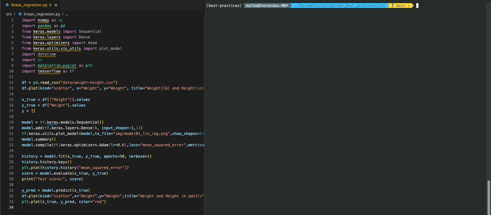
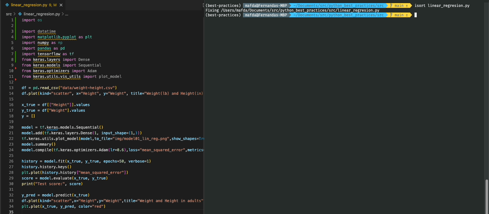
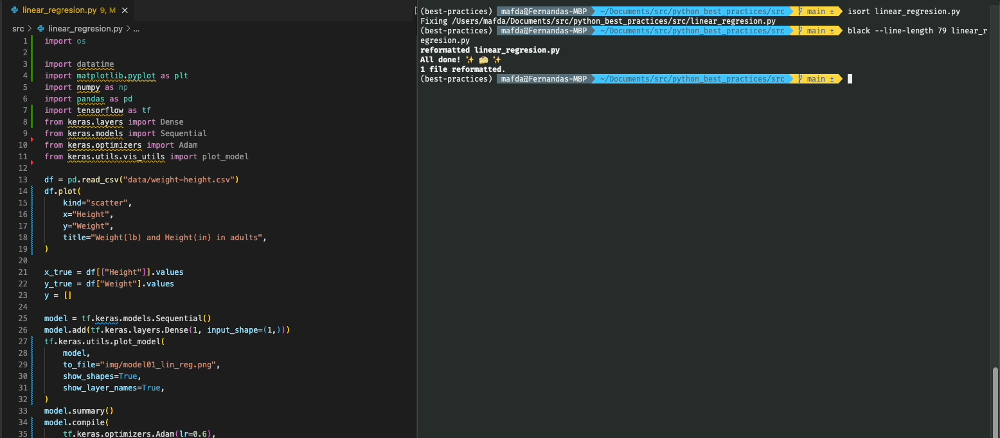
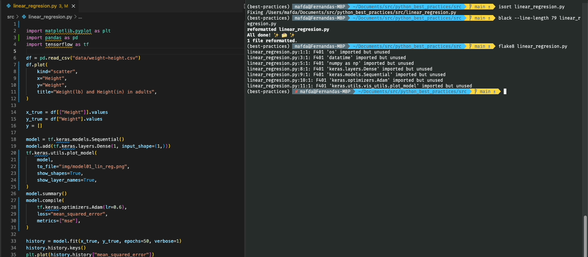

# Python Best Practices

**How can you make your code shine with isort, Black, Flake8 and Pylint?** 

In this repository, I would like to show some guidelines and best practice tips
on how to write Python code.

We can use a simple deck of programs to get our [code
styling](https://medium.com/semantixbr/how-to-make-your-code-shine-with-gitlab-ci-pipelines-48ade99192d1)
done. We can use **isort** for sorting the library imports (yes, imports have a
suggested order), we can check the existence of undesired artifacts using
**Flake8** and **Pylint**, and we can keep the code within the same style using
**Black**.

Those tools can be configured to be [PEP8](https://peps.python.org/pep-0008/)
compliant. **PEP8 — Python Enhancement Proposal**, is a style guide that
provides guidelines and best practices suggestions on how to write Python code.

## Python tools

* Importing sorting with [isort](https://pycqa.github.io/isort/)
* Formatting with [Black](https://github.com/psf/black) 
* Linting with [Flake8](https://flake8.pycqa.org/en/latest/) 
* Bug and quality checking with [Pylint](https://www.pylint.org/)

## Project Setup

### Clone this repository

```shell
(base)$: git clone git@github.com:mafda/python_best_practices.git
(base)$: cd python_best_practices 
```

### Configure environment

- Create the conda environment

```shell
(base)$: conda env create -f environment-dev.yml
```

- Or update with **development dependencies**

```shell
(base)$: conda env update -n your-project -f environment-dev.yml
```

- Activate the environment

```shell
(base)$: conda activate best-practices
```

## Use tools and clean your code!

```shell
(best-practices)$: cd your-project
```

### isort

You could use `isort .` or `isort . --check-only`



### Black

You could use `black --line-length 79 .` or `black --line-length 79 --check .`



### Flake8

You could use `flake8 .`



Fix errors:



### PyLint

You could use `find . -type f -name "*.py" | xargs pylint`

---

made with 💙 by [mafda](https://mafda.github.io/)
